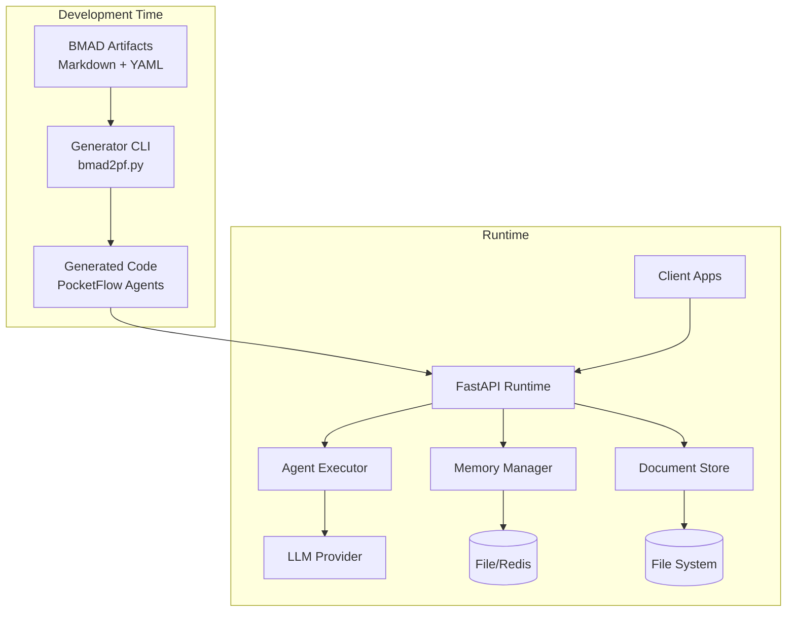
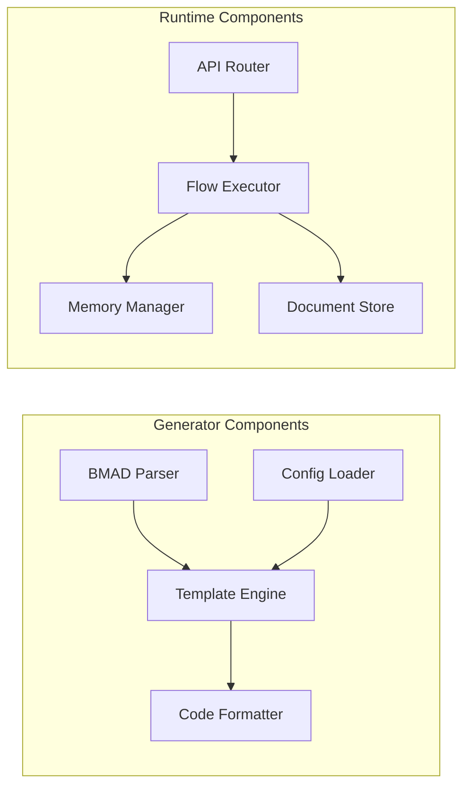
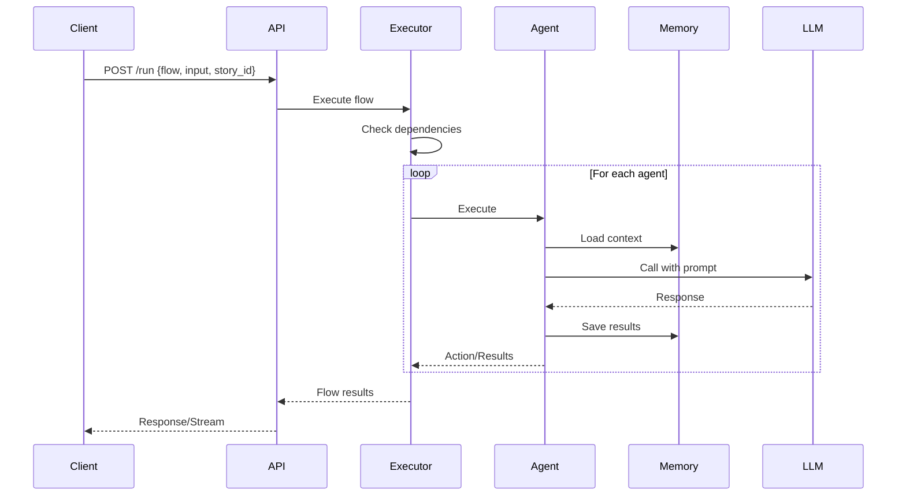
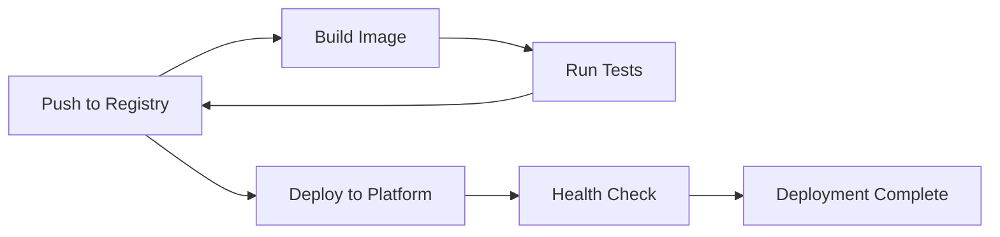

# BMAD → PocketFlow Generator & Runtime - Architecture Document

## Executive Summary

This architecture document defines the technical implementation for the BMAD → PocketFlow Generator & Runtime system, a lightweight tool that converts BMAD methodology artifacts into executable PocketFlow code and provides a FastAPI-based runtime for agent execution. The system follows a KISS (Keep It Simple, Stupid) approach with minimal dependencies, achieving sub-1 second generation times and enabling rapid deployment to any containerized platform.

### Key Architecture Decisions

- **Monolithic FastAPI Application**: Single Python service handles all runtime operations
- **Template-Based Code Generation**: Jinja2 templates for predictable, maintainable output
- **File-Based Memory by Default**: JSONL storage with optional Redis upgrade path
- **Async-First Design**: Full async/await pattern for I/O operations and parallel agent execution
- **Zero-Config Deployment**: Standard Dockerfile works across all platforms without modification

### System Overview



## System Context

### External Systems

1. **LLM Providers** (OpenAI, Anthropic, Google)
   - Purpose: Execute agent prompts and generate responses
   - Interface: REST API with provider-specific clients
   - Data Flow: Prompts out, completions in

2. **Container Platforms** (Docker, Railway, Fly.io, Cloud Run)
   - Purpose: Host and scale the runtime application
   - Interface: Docker container with environment variables
   - Data Flow: HTTP requests, logs, metrics

3. **Version Control** (GitHub)
   - Purpose: Store BMAD source files and trigger CI/CD
   - Interface: Git operations and GitHub Actions
   - Data Flow: Code commits, build artifacts

4. **Client Applications**
   - Purpose: Consume agent outputs and provide user interfaces
   - Interface: REST API endpoints
   - Data Flow: Flow execution requests, document CRUD, status queries

### System Boundaries

**In Scope:**
- BMAD file parsing and validation
- PocketFlow code generation
- Agent execution orchestration
- Document and memory management
- Basic observability and logging

**Out of Scope:**
- Frontend UI components
- Authentication/authorization (can be added via middleware)
- Complex workflow designers
- Multi-tenant isolation
- Distributed execution across multiple nodes

## Component Architecture

### High-Level Components



### Component Details

#### 1. Generator Components

**BMAD Parser** (`scripts/parser.py`)
- Responsibility: Extract metadata from Markdown files with YAML front-matter
- Key Classes: `AgentMetadata`, `MarkdownParser`
- Dependencies: PyYAML, pathlib
- Error Handling: Validates YAML structure, reports parsing errors with line numbers

**Config Loader** (`scripts/config_loader.py`)
- Responsibility: Load workflow.yaml and tools.yaml configurations
- Key Classes: `WorkflowConfig`, `ToolsRegistry`
- Dependencies: PyYAML
- Error Handling: Graceful handling of missing files, validation of references

**Template Engine** (`scripts/templates/`)
- Responsibility: Render Python code from Jinja2 templates
- Templates: `agent.py.j2`, `app.py.j2`, `tools.py.j2`
- Dependencies: Jinja2
- Error Handling: Template syntax validation, missing variable detection

**Code Formatter** (`scripts/formatter.py`)
- Responsibility: Apply consistent formatting to generated code
- Tools: Black, Ruff
- Dependencies: black, ruff
- Error Handling: Falls back to unformatted code if formatters fail

#### 2. Runtime Components

**API Router** (`generated/app.py`)
- Responsibility: Handle HTTP requests and route to appropriate handlers
- Endpoints: `/run`, `/doc/*`, `/memory/*`, `/agent/*`, `/health`
- Dependencies: FastAPI, Pydantic
- Error Handling: Request validation, standardized error responses

**Flow Executor** (`generated/executor.py`)
- Responsibility: Orchestrate agent execution with dependency management
- Key Classes: `FlowContext`, `AgentExecutor`, `ParallelGroup`
- Dependencies: asyncio, PocketFlow
- Error Handling: Retry logic, fallback handling, partial failure recovery

**Memory Manager** (`generated/memory.py`)
- Responsibility: Provide scoped storage for agent data
- Key Classes: `MemoryStore`, `FileBackend`, `RedisBackend`
- Dependencies: aiofiles, redis (optional)
- Error Handling: Atomic operations, corruption recovery

**Document Store** (`generated/documents.py`)
- Responsibility: Manage Markdown document lifecycle
- Key Classes: `DocumentManager`
- Dependencies: aiofiles, pathlib
- Error Handling: File locking, path validation

## Data Architecture

### Data Models

```python
# Core Data Models

class AgentMetadata:
    id: str
    description: str
    tools: list[str]
    memory_scope: str = "isolated"
    wait_for: dict = {"docs": [], "agents": []}
    parallel: bool = False
    prompt: str

class FlowRequest:
    flow: str = "default"
    input: str
    story_id: str

class FlowResponse:
    status: str  # "success" | "pending" | "error"
    results: dict = {}
    pending_docs: list[str] = []
    error: str = None

class Document:
    id: str
    content: str
    created_at: datetime
    updated_at: datetime

class MemoryEntry:
    key: str
    value: Any
    scope: str
    timestamp: datetime
```

### Data Flow



### Storage Strategy

**Documents** (`/docs/*.md`)
- Format: Plain Markdown files
- Naming: See [PRD Document Naming Convention](../prd.md#document-naming-convention)
- Persistence: File system
- Backup: Git repository

## Memory Contract

### Memory Storage Architecture

**Storage Format**: JSON Lines (JSONL) for append-only operations
- File-based: `/memory/{scope}/{key}.jsonl`
- Redis-based: Hash with key pattern `memory:{scope}:{key}`

### Concurrency Model

```python
# Append-only with optimistic locking
class MemoryManager:
    def __init__(self):
        self._cache = {}  # In-memory cache during flow
        self._locks = {}  # Per-key locks
    
    async def get(self, scope: str, key: str) -> Any:
        cache_key = f"{scope}:{key}"
        if cache_key in self._cache:
            return self._cache[cache_key]
        
        # Read from storage (file or Redis)
        value = await self._read_from_storage(scope, key)
        self._cache[cache_key] = value
        return value
    
    async def set(self, scope: str, key: str, value: Any):
        cache_key = f"{scope}:{key}"
        async with self._get_lock(cache_key):
            # Append to JSONL file
            await self._append_to_storage(scope, key, value)
            # Update cache
            self._cache[cache_key] = value
    
    async def flush(self):
        """Flush cache at end of flow execution"""
        self._cache.clear()
```

### Isolation Scopes

| Scope Type | Key Pattern | Storage Path | Use Case |
|------------|-------------|--------------|----------|
| Isolated | `{agent_id}:{story_id}` | `/memory/isolated/{agent_id}_{story_id}.jsonl` | Per-agent, per-story data |
| Shared | `shared:{namespace}` | `/memory/shared/{namespace}.jsonl` | Cross-agent shared data |

### Redis Configuration

```yaml
# config/runtime.yaml
llm:
  provider: openai
  model: gpt-4o

memory:
  backend: redis  # 'file' or 'redis'
  default_scope: isolated
  
  # Redis-specific settings
  redis:
    url: redis://localhost:6379/0
    pool_size: 10
    max_connections: 50
    ttl: 86400  # 24 hours default TTL
    key_prefix: bmad_pf_

on_missing_doc: skip  # 'wait' | 'skip' | 'error'
```

### on_missing_doc Behavior

- **wait**: Agent execution pauses, returns `{pending_docs: [...]}`
- **skip**: Agent receives empty string for missing doc, continues execution
- **error**: Agent execution fails with `DependencyError`

**Configuration** (`/config/*.yaml`)
- Format: YAML for human readability
- Files: `runtime.yaml` (see Memory Contract for example), `secrets.env`
- Persistence: File system
- Security: Environment variables for secrets

## Technical Architecture

### Technology Stack

The complete technology stack is documented in [tech-stack.md](./architecture/tech-stack.md). Key technologies include:

- **Language**: Python 3.10+ with full async/await support
- **Framework**: FastAPI for REST API with automatic documentation
- **LLM Framework**: Custom PocketFlow (100 lines)
- **Storage**: File-based with optional Redis for scaling
- **Deployment**: Docker containers on Railway/Fly.io/Cloud Run

See the full technology stack document for detailed specifications, version requirements, and decision rationale.

### API Design

API endpoints and performance targets are specified in the [PRD API Specification section](../prd.md#api-specification).

### Security Architecture

**Application Security**
- Input validation via Pydantic models
- Path traversal prevention in file operations
- SQL injection not applicable (no SQL database)
- XSS prevention through Markdown sanitization

**Secrets Management**
- API keys in environment variables
- `.env` file for local development
- Platform-specific secret management in production
- No secrets in generated code or logs

**Network Security**
- HTTPS termination at load balancer/proxy
- CORS configuration for known frontends
- Rate limiting via reverse proxy
- Request size limits in Uvicorn

**Future Considerations**
- JWT authentication middleware
- API key authentication
- Role-based access control
- Audit logging

## Implementation Guidelines

### Code Organization

The complete source tree structure is documented in [source-tree.md](./architecture/source-tree.md). The project follows a clear separation between:

- **User-editable sources** (`/bmad/`)
- **Generated code** (`/generated/`)
- **Runtime data** (`/memory/`, `/docs/`)
- **Configuration** (`/config/`)

See the source tree document for complete directory structure, file naming conventions, and organization guidelines.

### Development Workflow

1. **Edit BMAD Files**: Modify Markdown prompts and configurations
2. **Generate Code**: Run `python scripts/bmad2pf.py`
3. **Test Locally**: Start with `uvicorn generated.app:app --reload`
4. **Commit Changes**: Push BMAD sources (not generated code)
5. **CI/CD Pipeline**: Automatically generates, tests, and deploys

### Testing Strategy

**Unit Tests** (`tests/unit/`)
- Parser logic for BMAD files
- Template rendering accuracy
- Memory isolation verification
- Document CRUD operations

**Integration Tests** (`tests/integration/`)
- End-to-end flow execution
- API endpoint validation
- Parallel agent execution
- Dependency resolution

**Performance Tests** (`tests/performance/`)
- Generation time < 1 second
- API response times
- Memory usage under load
- Concurrent request handling

**Test Data** (`tests/fixtures/`)
- Sample BMAD files
- Mock LLM responses
- Test documents
- Configuration variants

### Coding Standards

The complete coding standards are documented in [coding-standards.md](./architecture/coding-standards.md). Key principles include:

- **Python Style**: PEP 8 compliance via Black and Ruff
- **Async-First**: All I/O operations use async/await
- **Type Hints**: Required for all public functions
- **Error Handling**: Explicit exception classes and retry patterns
- **Testing**: Minimum 80% coverage with pytest

See the coding standards document for detailed guidelines, patterns, and enforcement policies.

## Cross-Cutting Concerns

### Error Handling & Retry Strategy

```python
# Centralized retry policy
from tenacity import retry, stop_after_attempt, wait_exponential

RETRY_CONFIG = {
    'stop': stop_after_attempt(3),
    'wait': wait_exponential(multiplier=1, min=2, max=10),
    'reraise': True
}

@retry(**RETRY_CONFIG)
async def call_llm(prompt: str) -> str:
    """All LLM calls use this retry configuration"""
    pass

# Error hierarchy
class BMADError(Exception):
    """Base for all BMAD errors"""
    pass

class GeneratorError(BMADError):
    """Generation-time errors"""
    pass

class RuntimeError(BMADError):
    """Runtime execution errors"""
    pass

class DependencyError(RuntimeError):
    """Missing dependencies"""
    pass

class RateLimitError(RuntimeError):
    """Rate limit exceeded - triggers backoff"""
    pass
```

### LLM Stubbing Interface

```python
# llm_interface.py - Minimal LLM contract
from abc import ABC, abstractmethod
from typing import Protocol

class LLMProvider(Protocol):
    """Minimal interface for LLM providers"""
    
    async def complete(self, prompt: str) -> str:
        """Complete a prompt and return response text"""
        ...

# For testing - stub implementation
class MockLLM:
    def __init__(self, responses: dict = None):
        self.responses = responses or {}
        self.call_count = 0
    
    async def complete(self, prompt: str) -> str:
        self.call_count += 1
        # Return canned response or echo
        return self.responses.get(prompt, f"Mock response {self.call_count}")

# Injection point
def get_llm_provider() -> LLMProvider:
    if os.getenv("TESTING"):
        return MockLLM()
    # Production provider based on config
    return OpenAIProvider()  # or AnthropicProvider, etc.
```

### Rollback & Regeneration Strategy

**Generated Code Management**:
- `/generated/` directory is **never** committed to version control
- Each generation completely replaces previous content
- No versioning needed - BMAD sources are the single source of truth
- Rollback = checkout previous BMAD files + regenerate

**Deployment Safety**:
1. CI/CD always regenerates from BMAD sources
2. Docker build includes generation step
3. No manual edits to generated code survive deployment
4. Configuration (`runtime.yaml`) is preserved across regenerations

```bash
# Regeneration is always safe and idempotent
python scripts/bmad2pf.py --src ./bmad --out ./generated
# Previous generated code is completely replaced
```

## Performance Architecture

### Performance Requirements

Performance targets are defined in the [PRD Performance Requirements](../prd.md#performance-requirements).

### Optimization Strategies

**Generation Performance**
- Parallel file parsing with asyncio
- Template caching in memory
- Incremental generation (only changed files)
- Lazy loading of optional components

**Runtime Performance**
- Connection pooling for LLM providers
- Memory caching during flow execution
- Async I/O for all file operations
- Parallel agent execution where possible

**Scaling Approach**
- Horizontal scaling via container replication
- Stateless design enables load balancing
- Redis backend for shared memory at scale
- CDN for static document serving

### Monitoring & Observability

**Metrics**
- Request rate and latency (per endpoint)
- Agent execution time and success rate
- Memory operation performance
- LLM API usage and costs

**Logging**
```python
# Structured logging format
{
    "timestamp": "2024-01-15T10:30:45Z",
    "level": "INFO",
    "component": "executor",
    "agent": "analyst",
    "story_id": "S-123",
    "duration_ms": 245,
    "message": "Agent execution completed"
}
```

**Health Checks**
- Liveness: Basic process health
- Readiness: Dependencies available
- Startup: Initialization complete

## Deployment Architecture

### Container Strategy

```dockerfile
# Multi-stage Dockerfile
FROM python:3.10-slim as generator
WORKDIR /app
COPY bmad/ ./bmad/
COPY scripts/ ./scripts/
COPY config/ ./config/
RUN python scripts/bmad2pf.py --src ./bmad --out ./generated

FROM python:3.10-slim
WORKDIR /app
COPY requirements.txt .
RUN pip install --no-cache-dir -r requirements.txt
COPY --from=generator /app/generated ./generated
COPY --from=generator /app/config ./config
EXPOSE 8000
CMD ["uvicorn", "generated.app:app", "--host", "0.0.0.0", "--port", "8000"]
```

### CI/CD Pipeline



### Platform Configurations

**Primary Example - Railway**:
```toml
# railway.toml
[build]
builder = "DOCKERFILE"

[deploy]
healthcheckPath = "/health"
restartPolicyType = "ON_FAILURE"

[environment]
PORT = "8000"
```

**Other Platforms**:
- [Fly.io deployment guide](https://fly.io/docs/languages-and-frameworks/dockerfile/)
- [Google Cloud Run quickstart](https://cloud.google.com/run/docs/quickstarts/deploy-container)
- [Heroku container deployment](https://devcenter.heroku.com/articles/container-registry-and-runtime)

## Evolution & Extensibility

### Extension Points

1. **Custom Tools** - Add new tools via tools.yaml without modifying generator
2. **Memory Backends** - Implement new storage backends (DynamoDB, PostgreSQL)
3. **LLM Providers** - Add providers via configuration without code changes
4. **Middleware** - Insert authentication, rate limiting, monitoring
5. **Output Formats** - Extend beyond Markdown (JSON, HTML, PDF via post-processing)

### Migration Paths

**Scaling Up**
1. Switch from file to Redis memory backend
2. Add caching layer (Redis/Memcached)
3. Implement queue-based async processing
4. Deploy multiple instances behind load balancer

**Feature Additions**
1. Authentication → FastAPI middleware
2. Webhooks → Event dispatcher in executor
3. Scheduling → External cron or internal scheduler
4. Versioning → Git-based or database tracking

### Technical Debt Management

**Identified Debt**
- Synchronous LLM calls in some paths
- Limited error recovery strategies
- Basic logging without correlation IDs
- No request tracing

**Mitigation Plan**
1. Implement full async LLM clients
2. Add circuit breakers for external services
3. Introduce correlation IDs for request tracking
4. Add OpenTelemetry instrumentation

## Risk Analysis

### Technical Risks

| Risk | Impact | Likelihood | Mitigation |
|------|---------|------------|------------|
| LLM API rate limits | High | Medium | Implement backoff, queue requests |
| Memory corruption | High | Low | Atomic operations, backup storage |
| Generation performance degradation | Medium | Medium | Profiling, incremental generation |
| Container resource exhaustion | Medium | Low | Resource limits, monitoring |

### Operational Risks

| Risk | Impact | Likelihood | Mitigation |
|------|---------|------------|------------|
| Deployment failures | High | Low | Rollback strategy, health checks |
| Secret exposure | High | Low | Environment variables, secret scanning |
| Document loss | Medium | Low | Git backup, file system snapshots |
| Debugging complexity | Medium | Medium | Comprehensive logging, observability |

## Appendices

### A. Minimal BMAD Example

A complete minimal BMAD project for testing:

**`bmad/agents/analyst.md`**:
```markdown
---
id: analyst
description: Analyzes requirements and creates user stories
tools: [text_splitter]
memory_scope: shared:requirements
parallel: false
---

You are a requirements analyst. Break down the provided requirements into clear user stories.

For each requirement, create a story with:
- Clear actor (who)
- Specific action (what)
- Business value (why)

Output format:
- Story 1: As a [actor], I want [action], so that [value]
- Story 2: ...
```

**`bmad/agents/reviewer.md`**:
```markdown
---
id: reviewer
description: Reviews and validates user stories
memory_scope: shared:requirements
wait_for:
  agents: [analyst]
---

You are a quality reviewer. Review the user stories created by the analyst.

Check for:
- Completeness
- Clarity
- Testability

Provide feedback and a quality score (1-10).
```

**`bmad/tools.yaml`** (optional):
```yaml
text_splitter:
  module: utils.text
  call: split_into_chunks
  
validator:
  module: utils.validation
  call: validate_format
```

**`bmad/workflow.yaml`** (optional if using front-matter):
```yaml
flows:
  default:
    sequence:
      - analyst
      - reviewer
```

This minimal example provides:
- Two agents with dependencies
- Tool registration
- Memory sharing
- Complete testable flow

### B. Decision Log

| Decision | Rationale | Alternatives Considered | Date |
|----------|-----------|------------------------|------|
| Monolithic architecture | Simplicity, single deployment unit | Microservices (too complex for MVP) | 2024-01-10 |
| File-based memory default | Zero dependencies, human readable | SQLite (additional dependency) | 2024-01-11 |
| Jinja2 templates | Mature, flexible, Python native | String formatting (too limited) | 2024-01-12 |
| FastAPI framework | Modern, async, automatic docs | Flask (less async support) | 2024-01-13 |

### B. Interface Specifications

**Generator CLI Interface**
```bash
python scripts/bmad2pf.py [OPTIONS]

Options:
  --src PATH      Source directory with BMAD files [default: ./bmad]
  --out PATH      Output directory for generated code [default: ./generated]
  --verbose       Enable detailed output
  --check         Validate without generating
  --help          Show this message
```

**Environment Variables**
```bash
# Required
OPENAI_API_KEY=sk-...

# Optional
REDIS_URL=redis://localhost:6379
LOG_LEVEL=INFO
MAX_WORKERS=4
MEMORY_BACKEND=file|redis
```

### C. Development Setup

```bash
# Clone repository
git clone https://github.com/org/bmad-pocketflow
cd bmad-pocketflow

# Create virtual environment
python -m venv venv
source venv/bin/activate  # Windows: venv\Scripts\activate

# Install dependencies
pip install -r requirements.txt
pip install -r requirements-dev.txt

# Run generator
python scripts/bmad2pf.py

# Start development server
uvicorn generated.app:app --reload

# Run tests
pytest tests/
```

### D. Glossary

- **BMAD**: Business Method for Agent Development - methodology for defining agent workflows
- **PocketFlow**: Minimalist 100-line LLM framework for building AI applications
- **Front-matter**: YAML metadata at the beginning of Markdown files
- **Story ID**: Unique identifier for a specific execution context
- **Memory Scope**: Isolation level for agent data (isolated or shared)
- **Flow**: Collection of agents executed in defined sequence/parallel groups
- **JSONL**: JSON Lines format - one JSON object per line

## Approval & Sign-off

This architecture document defines the technical implementation for the BMAD → PocketFlow Generator & Runtime system. It provides a complete blueprint for development while maintaining the KISS principle and sub-1 second generation requirement.

**Document Status**: Ready for Implementation
**Version**: 1.0
**Date**: 2025-08-06
**Architect**: Winston (System Architect)

---

*This architecture document is a living document and will be updated as the system evolves. All changes should be tracked in the decision log and reviewed by the technical lead.*