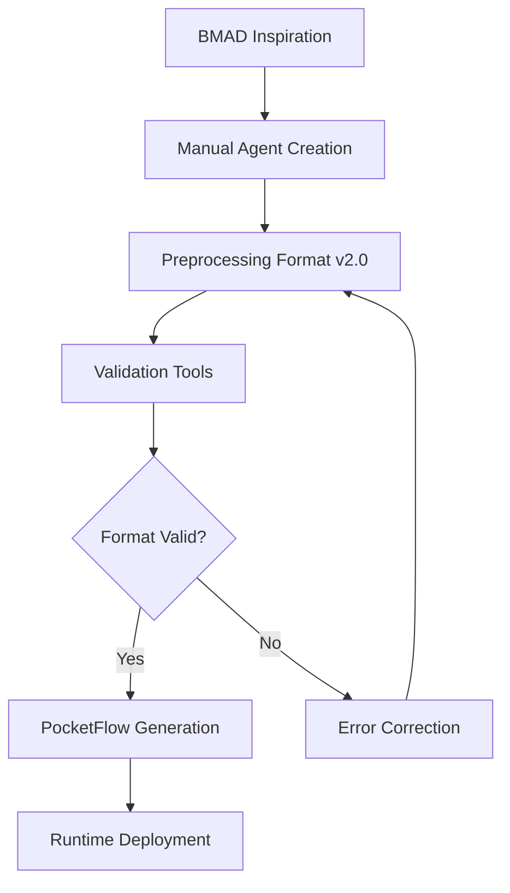

# BMAD → PocketFlow Generator & Runtime Product Requirements Document (PRD)

## Goals and Background Context

### Goals

**Primary Goals:**
- Provide an enhanced preprocessing format (v2.0) that preserves BMAD terminology (tasks, checklists, templates, commands, personas) while ensuring production-ready deterministic execution
- Provide an ultra-simple orchestrator for stateless agent execution with external system control
- Enable manual creation of sophisticated agent workflows using familiar BMAD concepts in a simplified, deterministic format

**Secondary Goals:**
- Provide a stateless FastAPI microservice runtime that can be deployed as a Docker container to any platform (local, Railway, Fly.io, Cloud Run)
- Deliver dynamic Markdown documentation via REST API for frontend display/editing and downstream agent consumption
- Support structured agent outputs with status tracking (completed|needs_input|failed)
- Establish a KISS (Keep It Simple, Stupid) development approach with minimal dependencies and maximum flexibility

### Background Context

**Enhanced Preprocessing Format Challenge:**
The current simple preprocessing format lacks the expressiveness needed to capture sophisticated agent workflows inspired by BMAD methodology. Users familiar with BMAD concepts (tasks, checklists, templates, personas, commands) need a more powerful input format while maintaining the deterministic execution guarantees required for production systems.

**Two-Layer Architecture Solution:**
1. **Enhanced Preprocessing Layer (preprocessing/ v2.0)**: Sophisticated, manually-created agent format that preserves BMAD terminology while ensuring deterministic execution
2. **PocketFlow Runtime**: Enhanced 100-line framework with ultra-simple orchestration and stateless agent execution

**Manual Creation Approach:**
Users manually create preprocessing agents using the enhanced v2.0 format, drawing inspiration from BMAD methodology but within the constraints of deterministic execution. This approach ensures complete control over complexity while enabling sophisticated workflows.

The solution follows an "Agentic Coding" philosophy where humans design high-level flows and the system generates deterministic executable code. The entire stack prioritizes simplicity over features, using only essential Python dependencies and Markdown as the universal document format.

### Change Log

| Date | Version | Description | Author |
|------|---------|-------------|---------|
| 2025-08-06 | 0.31 | Initial PRD creation based on design document | John (PM Agent) |
| 2025-08-07 | 0.40 | Major scope expansion: BMAD-to-Preprocessing conversion, Ultra-simple orchestrator, Stateless agents, Enhanced preprocessing format | John (PM Agent) |

## Requirements

### Functional

**Core Preprocessing & Generation:**
- FR1: The CLI generator shall parse preprocessing Markdown files (formerly bmad/) with enhanced YAML front-matter to extract agent metadata, BMAD terminology (tasks, checklists, templates, commands), and execution settings
- FR2: The system shall support optional workflow.yaml files for defining agent execution sequences when not specified in front-matter
- FR3: The generator shall load and register custom tools from an optional tools.yaml file as PocketFlow @utool decorators
- FR4: The runtime shall expose a /run endpoint accepting flow name, input text, and story_id, returning either streamed results or pending document lists
- FR5: The system shall provide /doc/{id} endpoints for GET/PUT operations on Markdown documents stored in the /docs directory
- FR6: The runtime shall implement memory isolation with support for isolated (per-agent/story) and shared namespace scopes
- FR7: The generator shall render Jinja templates to produce Python code for agents and the FastAPI application
- FR8: The system shall support parallel agent execution through asyncio TaskGroups when agents are marked with parallel:true
- FR9: The runtime shall check for required document dependencies before agent execution and return pending_docs list when missing
- FR10: The system shall provide /agent/{name}/ready and /memory/{scope}/{key} endpoints for debugging and status checking
- FR11: The generator shall apply Python formatters (black/ruff) to all generated code before output
- FR12: The system shall maintain runtime configuration in runtime.yaml that is never overwritten by the generator
- FR13: The runtime shall support both file-based and Redis-based memory backends configured via runtime.yaml
- FR14: The system shall cache memory in RAM during flow execution and flush at completion for performance optimization
- FR15: The generator shall complete full code generation in under 1 second for typical BMAD projects

### Non Functional

- NFR1: The entire generator and runtime must use only Python ≥ 3.10 with minimal dependencies (pocketflow, fastapi, uvicorn, pydantic)
- NFR2: All static and dynamic documentation must be in Markdown format (.md files) with no PDF or Word document support
- NFR3: The system must provide a single standard Dockerfile that works across all hosting platforms without modification
- NFR4: Generated code in /generated directory must be completely regeneratable and never require manual editing
- NFR5: The runtime must achieve initialization time under 1 second for rapid iteration
- NFR6: The system must support "no-surprise deployments" with predictable behavior across different environments
- NFR7: API responses must use standard HTTP status codes and provide clear error messages for debugging
- NFR8: The solution must maintain clear separation between source BMAD files, configuration, and generated code
- NFR9: Memory operations must be atomic and thread-safe for concurrent agent execution
- NFR10: The system must provide sufficient logging and observability hooks without impacting performance

## User Interface Design Goals

*Note: This PRD focuses on backend API and CLI tools. UI/UX requirements are minimal as the primary interface is REST API and command-line.*

### Overall UX Vision

The user experience centers on developer simplicity - a single CLI command generates everything needed, and a standard REST API provides all runtime functionality. No complex configuration or setup required.

### Key Interaction Paradigms

- Command-line driven generation with clear progress feedback
- RESTful API following standard conventions for all runtime operations
- File-based configuration that developers can edit with any text editor
- Markdown documents as the universal format for both input and output

### Core Screens and Views

- CLI output showing generation progress and timing
- API documentation (auto-generated via FastAPI)
- Markdown document endpoints for viewing/editing
- Debug endpoints for memory and agent status

### Accessibility: None

This is a developer tool with CLI and API interfaces. Standard terminal and HTTP client accessibility applies.

### Branding

No specific branding requirements. Focus on clean, minimal output that integrates well with developer workflows.

### Target Device and Platforms: Web Responsive

REST API accessible from any HTTP client. CLI tool runs on any platform supporting Python 3.10+.

## Technical Assumptions

### Repository Structure: Monorepo

All BMAD source files, generator, runtime, and configuration exist in a single repository for simplicity and version consistency.

### Service Architecture

**Monolithic FastAPI Application** - A single Python application serves all endpoints and manages agent execution. This aligns with the KISS principle and eliminates distributed system complexity. The monolith can be horizontally scaled if needed by running multiple container instances behind a load balancer.

### Testing Requirements

**Unit + Integration Testing** - Unit tests for generator logic and individual agent functions. Integration tests for full flow execution including API endpoints and memory operations. Smoke tests validate basic /run functionality with minimal stories.

### Additional Technical Assumptions and Requests

- Python 3.10+ is available in all deployment environments
- Docker is used for containerization with multi-stage builds for optimization
- GitHub Actions provides CI/CD pipeline functionality
- Environment variables handle secret management (API keys)
- JSONL format for file-based memory storage provides human-readable persistence
- Jinja2 templating engine for code generation provides flexibility
- Black and Ruff formatters ensure consistent Python code style
- FastAPI automatic API documentation via OpenAPI/Swagger
- Uvicorn ASGI server for production Python web serving
- Async/await patterns throughout for I/O-bound operations
- No authentication/authorization in MVP (can be added via middleware later)
- Single LLM provider configuration (can be extended to support multiple)
- Local file system for document storage (can be extended to cloud storage)

## Epic List

- **Epic 1: Foundation & CLI Generator**: Establish project structure, implement BMAD parser, template engine, and CLI tool that generates executable PocketFlow code from BMAD artifacts
- **Epic 2: FastAPI Runtime & Core API**: Create the FastAPI application with /run endpoint, memory management, and document storage/retrieval capabilities
- **Epic 3: Agent Orchestration & Parallel Execution**: Implement agent dependency checking, parallel execution with asyncio, and comprehensive flow orchestration logic
- **Epic 4: Deployment & Operations**: Package application in Docker container, setup CI/CD pipeline, and enable deployment to cloud platforms

## Epic 1: Foundation & CLI Generator

**Goal**: Create the foundational project structure and implement a CLI tool that parses BMAD artifacts (Markdown files with YAML front-matter, workflow.yaml, tools.yaml) and generates executable PocketFlow code using Jinja templates, completing generation in under 1 second.

### Story 1.1: Project Foundation and Development Environment

**As a** developer,
**I want** a properly structured Python project with all necessary dependencies and development tools configured,
**so that** I can begin implementing the BMAD to PocketFlow generator with a consistent development environment.

#### Acceptance Criteria

1. Python project structure created with /bmad, /generated, /scripts, /config, /docs, /tests directories
2: Project initialized with pyproject.toml or setup.py including all required dependencies (pocketflow, fastapi, uvicorn, pydantic, jinja2, pyyaml, black, ruff)
3: Development environment configuration documented in README with setup instructions
4: Pre-commit hooks configured for black and ruff code formatting
5: Basic pytest configuration established with example test file
6: .gitignore properly configured to exclude /generated directory and environment files
7: Virtual environment setup automated via requirements.txt or Pipfile

### Story 1.2: BMAD Markdown Parser with Front-matter Support

**As a** developer,
**I want** to parse BMAD Markdown files and extract agent metadata from YAML front-matter,
**so that** I can understand agent configuration including id, tools, memory scope, and dependencies.

#### Acceptance Criteria

1: Parser successfully extracts YAML front-matter from Markdown files using yaml.safe_load()
2: Agent metadata object created with fields: id, description, tools, memory_scope, wait_for, parallel
3: Parser handles missing front-matter gracefully (returns agent with defaults)
4: Markdown content after front-matter preserved as agent prompt text
5: Parser validates required fields and reports clear errors for malformed YAML
6: Unit tests verify parsing of various front-matter configurations
7: Parser can process all .md files in /bmad/agents/ directory in single pass

### Story 1.3: Workflow and Tools Configuration Loaders

**As a** developer,
**I want** to load optional workflow.yaml and tools.yaml configuration files,
**so that** I can define agent execution sequences and register custom tools for use in generated code.

#### Acceptance Criteria

1: Workflow loader reads workflow.yaml and extracts agent execution order and parallel groups
2: Tools loader reads tools.yaml and creates tool registry with module and function references
3: Both loaders handle missing files gracefully (system works without them)
4: Configuration merged with agent metadata from front-matter (front-matter takes precedence)
5: Validation ensures referenced agents and tools exist before generation
6: Clear error messages for invalid workflow definitions or tool references
7: Unit tests verify configuration loading and merging logic

### Story 1.4: Jinja Template Engine and Code Generation

**As a** developer,
**I want** to render Python code from Jinja templates using parsed BMAD metadata,
**so that** I can generate executable PocketFlow agents and FastAPI application code.

#### Acceptance Criteria

1: Jinja templates created for agents/*.py and app.py in appropriate template directory
2: Template renderer accepts agent metadata and generates valid Python code
3: Generated code includes proper imports, class definitions, and PocketFlow decorators
4: Tool references from tools.yaml converted to @utool decorated functions
5: All generated code written to /generated directory preserving structure
6: Generated code passes black and ruff formatting without errors
7: Template rendering completes for typical project in under 500ms

### Story 1.5: CLI Tool with Progress Feedback

**As a** developer,
**I want** a command-line tool that orchestrates the complete generation pipeline,
**so that** I can convert BMAD artifacts to PocketFlow code with a single command.

#### Acceptance Criteria

1: CLI script (bmad2pf.py) accepts --src and --out parameters for input/output directories
2: Progress messages displayed for each pipeline stage with timing information
3: Total generation time displayed upon completion (must be under 1 second)
4: Clear error messages with file locations for any parsing or generation failures
5: --verbose flag provides detailed debug output when needed
6: --help displays usage information and available options
7: Exit codes properly set (0 for success, non-zero for errors)
8: Integration test verifies end-to-end generation from sample BMAD files

## Epic 2: FastAPI Runtime & Core API

**Goal**: Build the FastAPI application runtime that hosts generated agents, provides RESTful endpoints for flow execution and document management, and implements file-based memory storage with proper isolation per agent and story.

### Story 2.1: FastAPI Application Bootstrap and Configuration

**As a** developer,
**I want** a FastAPI application that loads runtime configuration and initializes with generated agents,
**so that** I can serve agent flows via REST API with proper settings management.

#### Acceptance Criteria

1: FastAPI application created with proper app structure and routing setup
2: Runtime.yaml configuration loaded on startup (LLM provider, model, memory backend settings)
3: Environment variables loaded from secrets.env for API keys
4: Generated agents imported dynamically from /generated/agents directory
5: Health check endpoint (/health) returns service status and version
6: Automatic API documentation available at /docs (FastAPI built-in)
7: Uvicorn server configuration optimized for production use
8: Application starts in under 1 second with clear startup logging

### Story 2.2: Document Storage API with Markdown Support

**As a** developer,
**I want** REST endpoints to store and retrieve Markdown documents,
**so that** agents can read inputs and write outputs that frontends can display.

#### Acceptance Criteria

1: GET /doc/{id} retrieves Markdown content from /docs/{id}.md file
2: PUT /doc/{id} stores Markdown content to /docs/{id}.md file
3: GET /doc/{id}/status returns {"exists": bool} for document availability checking
4: Missing documents return 404 with clear error message
5: Document IDs validated to prevent directory traversal attacks
6: Markdown content served with appropriate Content-Type header
7: File I/O operations are async to prevent blocking
8: Unit tests verify CRUD operations and error handling

### Story 2.3: Memory Storage with File-based Backend

**As a** developer,
**I want** a memory storage system using JSONL files with proper isolation,
**so that** agents can persist and retrieve data with correct scoping per agent and story.

#### Acceptance Criteria

1: Memory manager implements get/set operations with scope-based key generation
2: Isolated scope uses pattern {agent}/{story_id} for keys, stored in memory/agent_story.jsonl
3: Shared scope uses namespace directly as key, stored in memory/shared_{namespace}.jsonl
4: Memory cached in RAM during flow execution for performance
5: Cache flushed to JSONL files at flow completion
6: GET /memory/{scope}/{key} endpoint for debugging memory contents
7: PUT /memory/{scope}/{key} endpoint for manual memory updates
8: Thread-safe operations for concurrent access
9: Unit tests verify isolation between different scopes and stories

### Story 2.4: Flow Execution Endpoint with Basic Orchestration

**As a** developer,
**I want** a /run endpoint that executes agent flows with provided input,
**so that** users can trigger agent processing via REST API.

#### Acceptance Criteria

1: POST /run accepts JSON with flow (default "default"), input (prompt text), and story_id
2: Endpoint triggers sequential execution of agents in specified flow
3: Response returns either completed results or {"pending_docs": [...]} if documents missing
4: Memory context properly initialized with story_id for agent isolation
5: Execution errors caught and returned as 500 responses with error details
6: Request validation ensures required fields present
7: Async execution prevents blocking other requests
8: Integration test verifies basic flow execution with mock agents

## Epic 3: Agent Orchestration & Parallel Execution

**Goal**: Implement sophisticated agent orchestration including dependency checking, parallel execution capabilities using asyncio TaskGroups, and comprehensive flow control that respects wait_for dependencies and enables concurrent agent processing.

### Story 3.1: Agent Dependency Resolution and Validation

**As a** developer,
**I want** agents to check their dependencies before execution,
**so that** flows halt gracefully when required documents or predecessor agents haven't completed.

#### Acceptance Criteria

1: Dependency checker validates both document dependencies (wait_for.docs) and agent dependencies (wait_for.agents)
2: Document dependencies checked against /docs directory for existence
3: Agent dependencies checked against completed agents list in current flow execution
4: Missing dependencies returned as structured list for client handling
5: on_missing_doc configuration controls behavior (wait, skip, or error)
6: Clear dependency graph can be generated for debugging
7: Circular dependencies detected and reported as errors
8: Unit tests verify various dependency scenarios and edge cases

### Story 3.2: Parallel Agent Execution with AsyncIO

**As a** developer,
**I want** agents marked with parallel:true to execute concurrently,
**so that** independent agents can process simultaneously for better performance.

#### Acceptance Criteria

1: Parallel agents identified from metadata and grouped for concurrent execution
2: AsyncIO TaskGroup used to manage parallel agent execution
3: Each parallel group waits for all members to complete before proceeding
4: Errors in one parallel agent don't crash others in same group
5: Memory isolation maintained even during parallel execution
6: Execution order preserved for sequential agents between parallel groups
7: Performance test demonstrates time savings with parallel execution
8: Logging clearly shows parallel execution start/end for each agent

### Story 3.3: Comprehensive Flow Orchestration Logic

**As a** developer,
**I want** complete flow orchestration that handles sequential, parallel, and dependent agent execution,
**so that** complex BMAD workflows execute correctly according to their defined patterns.

#### Acceptance Criteria

1: Flow orchestrator builds execution plan from agent metadata and workflow configuration
2: Sequential agents execute in defined order with results passing between them
3: Parallel groups identified and executed concurrently at appropriate points
4: Dependencies checked before each agent/group execution
5: Flow context maintains state across entire execution (completed agents, results, errors)
6: Graceful handling of partial failures with clear error reporting
7: GET /agent/{name}/ready endpoint reports last successful execution timestamp
8: Integration tests verify complex flows with mixed sequential/parallel execution

### Story 3.4: Stream Response and Progress Reporting

**As a** developer,
**I want** the /run endpoint to support streaming responses with progress updates,
**so that** clients can display real-time execution status for long-running flows.

#### Acceptance Criteria

1: /run endpoint supports Accept: text/event-stream header for SSE responses
2: Progress events sent as agents start and complete execution
3: Intermediate results streamed as they become available
4: Final results or pending_docs sent as completion event
5: Connection handling robust to client disconnections
6: Non-streaming clients still receive final JSON response
7: Progress includes agent name, status, and execution time
8: Frontend integration test demonstrates real-time progress display

## Epic 4: Deployment & Operations

**Goal**: Package the complete system in a production-ready Docker container, establish CI/CD pipelines via GitHub Actions, and enable seamless deployment to various cloud platforms while maintaining operational simplicity.

### Story 4.1: Docker Containerization with Multi-stage Build

**As a** developer,
**I want** a Dockerfile that packages the entire application efficiently,
**so that** the system can be deployed consistently across different environments.

#### Acceptance Criteria

1: Multi-stage Dockerfile created with builder stage for generation and runtime stage for execution
2: Only necessary files copied to final image (no source BMAD files or test files)
3: Python dependencies installed via pip with pinned versions for reproducibility
4: Container starts with single CMD running uvicorn with proper production settings
5: Environment variables documented for runtime configuration
6: Health check configured in Dockerfile for container orchestration
7: Final image size under 200MB with Alpine Linux base
8: Docker build completes in under 60 seconds with layer caching

### Story 4.2: GitHub Actions CI/CD Pipeline

**As a** developer,
**I want** automated CI/CD that generates code, builds containers, and deploys on push,
**so that** changes automatically flow from repository to production without manual intervention.

#### Acceptance Criteria

1: GitHub Actions workflow triggered on push to main branch
2: Workflow runs generator (bmad2pf.py) to create fresh code from BMAD sources
3: Docker image built and tagged with commit SHA
4: Image pushed to GitHub Container Registry (ghcr.io)
5: Tests run before deployment (pytest for unit and integration tests)
6: Deployment step updates specified service (Railway/Fly.io/Cloud Run)
7: Rollback capability via previous image tags
8: Build status badge displayed in repository README

### Story 4.3: Cloud Platform Deployment Configuration

**As a** developer,
**I want** deployment configurations for major cloud platforms,
**so that** teams can deploy to their preferred infrastructure with minimal configuration.

#### Acceptance Criteria

1: Railway.toml configuration for Railway platform deployment
2: fly.toml configuration for Fly.io deployment
3: Cloud Run service YAML for Google Cloud Platform deployment
4: Environment variable management documented for each platform
5: Deployment commands included in CI/CD pipeline with platform selection
6: Monitoring and logging integration points documented
7: Scaling configuration (min/max instances) specified appropriately
8: Deployment guide in docs/ covering each platform step-by-step

### Story 4.4: Operational Monitoring and Observability

**As a** developer,
**I want** basic monitoring and observability built into the runtime,
**so that** I can debug issues and track system performance in production.

#### Acceptance Criteria

1: Structured logging throughout application using Python logging module
2: Request/response logging with timing for all API endpoints
3: Agent execution metrics logged (start, end, duration, success/failure)
4: Memory operation metrics tracked for performance analysis
5: Error tracking with stack traces for debugging
6: Health check endpoint includes system metrics (memory, queue depth)
7: OpenTelemetry hooks prepared (but not required) for APM integration
8: Log aggregation pattern documented for production environments

## Epic 5: Enhanced Preprocessing Format v2.0

**Goal**: Design and implement enhanced preprocessing format that preserves BMAD terminology (tasks, checklists, templates, personas, commands) for manual agent creation, enabling sophisticated workflow definition while maintaining deterministic execution and KISS principles.

### Story 5.1: Enhanced Preprocessing Template Design

**As a** developer familiar with BMAD methodology,
**I want** an enhanced preprocessing format that preserves familiar BMAD terminology and concepts,
**so that** I can manually create sophisticated agent workflows using familiar patterns while ensuring deterministic PocketFlow execution.

#### Acceptance Criteria

1. **BMAD Terminology Preservation**: Format includes `persona`, `tasks`, `checklists`, `templates`, `commands` fields that map directly to familiar BMAD concepts
2. **Cookbook Pattern Integration**: Template design incorporates proven patterns from PocketFlow cookbook examples (stateless execution, structured outputs, external control)
3. **Schema Validation**: Complete JSON schema defined for preprocessing format v2.0 with clear validation rules and error messaging
4. **Documentation and Examples**: Comprehensive documentation with 5+ example agents covering common patterns (analyst, PM, architect, QA)
5. **Backward Compatibility**: Enhanced format v2.0 maintains full compatibility with existing v1.0 simple format
6. **Manual Creation Support**: Format optimized for human readability and editability with clear YAML structure
7. **Generator Integration**: Enhanced parser implemented that can process v2.0 format and generate appropriate PocketFlow Node classes
8. **Validation Tooling**: Command-line validation tool that checks preprocessing agents against schema and provides helpful error correction guidance

#### Technical Notes

- Template should map BMAD `tasks` to PocketFlow Node execution patterns
- `checklists` should integrate with structured output validation
- `templates` should support Jinja2-style placeholders for dynamic content
- `persona` should be injectable into agent prompt templates
- Focus on simplicity - avoid over-engineering complex features

### Story 5.2: Cookbook Pattern Mapping and Integration

**As a** system architect,
**I want** the preprocessing format to leverage proven PocketFlow cookbook patterns,
**so that** generated agents follow established, tested execution patterns rather than creating new untested approaches.

#### Acceptance Criteria

1. **Stateless Execution Mapping**: Enhanced format generates agents following `pocketflow-structured-output/` stateless pattern
2. **External Control Integration**: Generated orchestration follows `pocketflow-communication/` external control pattern
3. **Validation Pattern Usage**: Checklist functionality uses `pocketflow-supervisor/` validation pattern
4. **Error Handling**: Generated agents use cookbook error handling patterns with retry logic
5. **Performance Optimization**: Template generation follows cookbook performance patterns for sub-1s generation time
6. **Testing Integration**: Generated agents compatible with cookbook testing patterns from `pocketflow-workflow/` examples
7. **Documentation Mapping**: Clear documentation showing which BMAD concepts map to which cookbook patterns
8. **Pattern Validation**: Validation tools verify that generated agents follow established cookbook patterns correctly

#### Technical Notes

- Reuse existing cookbook Node classes where possible rather than generating new ones
- Ensure generated agents are compatible with existing PocketFlow Flow orchestration
- Maintain cookbook naming conventions and code style

### Story 5.3: Ultra-Simple Orchestrator Status Tracking

**As an** external workflow system,
**I want** a minimal orchestrator that only tracks agent execution status without embedded business logic,
**so that** I can control workflow execution decisions while getting clear visibility into agent states.

#### Acceptance Criteria

1. **Status-Only API**: Orchestrator provides GET/PUT endpoints for status tracking without any execution decision logic
2. **External System Control**: All workflow decisions (retry, parallel execution, error handling) made by external systems
3. **Structured Status Objects**: Status tracking uses clear JSON format: `{workflow_id, agent_statuses: {agent_id: {status, last_execution, output_summary}}}`
4. **Real-time Updates**: Status updates available immediately after agent execution via REST API
5. **No Embedded Logic**: Orchestrator contains zero business logic for flow control, dependencies, or error recovery
6. **Multiple Workflow Support**: Can track status for multiple concurrent workflows without interference
7. **Simple Persistence**: Status stored in file-based format (JSONL) following KISS principle
8. **Clear API Documentation**: OpenAPI specification for external system integration

### Story 5.4: Stateless Agent Execution with Structured Outputs

**As an** external workflow system,
**I want** agents that execute in completely stateless mode with predictable structured outputs,
**so that** I can provide complete context per call and receive consistent, parseable responses for workflow orchestration.

#### Acceptance Criteria

1. **Complete Context Per Call**: Every agent execution receives full context (documents, previous results, instructions) in single request
2. **Structured Response Format**: All agents return consistent format: `{status: "completed|needs_input|failed", content: str, summary: str, missing_inputs: [str], metadata: dict}`
3. **No Session State**: Agents maintain no state between executions - identical inputs produce identical outputs
4. **Mid-Execution Input Requests**: Agents can return `needs_input` status with explicit list of missing requirements
5. **Error Handling**: Failed executions return structured error information in standard format
6. **Performance Consistency**: Stateless execution maintains sub-1s generation performance requirement
7. **Memory Isolation**: Each execution isolated from others while supporting optional shared memory scopes
8. **Validation Integration**: All outputs validated against structured format with clear error messages

#### Technical Notes

- Leverage cookbook stateless patterns from `pocketflow-agent/` and `pocketflow-structured-output/`
- Ensure compatibility with existing FastAPI runtime infrastructure
- Maintain backward compatibility with existing stateful agents

## Epic 6: Ultra-Simple Orchestrator

**Goal**: Implement minimal orchestrator that only tracks workflow status without embedded business logic, enabling complete external system control while maintaining KISS principles.

### Story 6.1: Status-Only Orchestration API

**As an** external workflow engine,
**I want** a minimal REST API that only tracks agent execution status,
**so that** I can make all workflow decisions while getting clear visibility into execution states.

#### Acceptance Criteria

1. **GET /orchestration/status**: Returns workflow status with agent states in JSON format
2. **PUT /orchestration/status**: Allows external systems to update agent execution status
3. **No Business Logic**: Orchestrator contains zero logic for flow control, retries, or error handling
4. **File-Based Storage**: Status persisted in JSONL format following KISS principle
5. **Multi-Workflow Support**: Can track multiple concurrent workflows without interference
6. **Real-Time Updates**: Status changes immediately visible via API
7. **Simple Data Model**: Status format: `{workflow_id, story_id, agent_statuses: {agent_id: {status, last_execution}}}`
8. **OpenAPI Documentation**: Complete API specification for external system integration

## Epic 7: Stateless Agent Architecture

**Goal**: Implement completely stateless agent execution with structured outputs and complete context per call, ensuring predictable and reproducible behavior.

### Story 7.1: Stateless Agent Execution Engine

**As an** external system,
**I want** agents that execute with complete context provided in each call,
**so that** I get predictable, reproducible results without hidden state dependencies.

#### Acceptance Criteria

1. **POST /agent/{agent_id}/execute**: Stateless execution endpoint with complete context per request
2. **Complete Context Input**: Every call includes full context: `{instruction, documents, context_data, execution_id}`
3. **Structured Response**: All agents return: `{status: "completed|needs_input|failed", content, summary, missing_inputs, metadata}`
4. **No Session State**: Identical inputs always produce identical outputs regardless of execution history
5. **Mid-Execution Input Requests**: Agents can return `needs_input` with explicit missing requirements list
6. **Error Handling**: Failed executions return structured error information in standard format
7. **Performance**: Stateless execution maintains sub-1s performance requirement
8. **Validation**: All outputs validated against structured format with clear error messages

#### Technical Notes

- Use cookbook patterns from `pocketflow-structured-output/` and `pocketflow-agent/`
- Maintain compatibility with existing FastAPI infrastructure
- Ensure backward compatibility with existing stateful execution mode

## Checklist Results Report

### Executive Summary

- **Overall PRD Completeness**: 92%
- **MVP Scope Appropriateness**: Just Right
- **Readiness for Architecture Phase**: Ready
- **Most Critical Gaps**: Minor gaps in user research documentation and competitive analysis

### Category Analysis Table

| Category | Status | Critical Issues |
|----------|--------|-----------------|
| 1. Problem Definition & Context | PASS | None - Clear problem statement and business goals defined |
| 2. MVP Scope Definition | PASS | None - Well-scoped MVP with clear boundaries |
| 3. User Experience Requirements | PARTIAL | Limited UI requirements (appropriate for API-focused tool) |
| 4. Functional Requirements | PASS | None - Comprehensive and testable requirements |
| 5. Non-Functional Requirements | PASS | None - Performance and technical constraints well defined |
| 6. Epic & Story Structure | PASS | None - Logical progression with sized stories |
| 7. Technical Guidance | PASS | None - Clear technical direction provided |
| 8. Cross-Functional Requirements | PASS | None - Data and integration needs addressed |
| 9. Clarity & Communication | PASS | None - Well-structured and clear documentation |

### Top Issues by Priority

**BLOCKERS**: None identified

**HIGH**:
- Add specific user personas (BMAD methodology users, DevOps engineers)
- Include basic competitive analysis (other code generators)

**MEDIUM**:
- Expand on error handling strategies for better developer experience
- Add specific performance benchmarks beyond "under 1 second"

**LOW**:
- Consider adding example BMAD files in appendix
- Include glossary of BMAD-specific terms

### MVP Scope Assessment

The MVP scope is appropriately sized:
- **Core functionality** focuses on essential BMAD→PocketFlow conversion
- **Excluded features** (authentication, multiple LLM providers) are correctly deferred
- **Complexity** is manageable with clear technical boundaries
- **Timeline** realistic with 6-8 day estimate for experienced developer (adjust after initial spike)

### Technical Readiness

- **Technical constraints** clearly specified (Python 3.10+, minimal dependencies)
- **Architecture decision** (monolithic FastAPI) aligns with KISS principle
- **Identified risks**: Generation performance, memory management under load
- **Areas for investigation**: Redis memory backend performance, optimal Jinja template structure

## API Specification

| Endpoint | Method | Request Body | Response | Performance Target |
|----------|--------|--------------|----------|-------------------|
| `/run` | POST | `{flow: str, input: str, story_id: str}` | Stream or `{status, results}` | p95 < 100ms (excl. LLM) |
| `/doc/{id}` | GET | - | Markdown content | p95 < 50ms |
| `/doc/{id}` | PUT | Markdown content | `{success: bool}` | p95 < 80ms |
| `/doc/{id}/status` | GET | - | `{exists: bool}` | p95 < 30ms |
| `/agent/{name}/ready` | GET | - | `{ready: bool, last_execution}` | p95 < 30ms |
| `/memory/{scope}/{key}` | GET | - | JSON value | p95 < 50ms |
| `/health` | GET | - | `{status, version, uptime}` | p95 < 20ms |

## Document Naming Convention

**Fixed Format**: `{story_id}__{agent_id}.md`
- Example: `S-123__analyst.md`
- Story ID: User-provided identifier for the execution context
- Agent ID: Lowercase agent name from BMAD definition
- This convention is enforced and cannot be overridden

### Recommendations

1. **Add User Research Section**: Include brief personas for BMAD users and their workflow needs
2. **Expand Performance Metrics**: Define specific benchmarks (e.g., "generate 50 agents in <1s")
3. **Include Error Scenarios**: Document expected error cases and recovery strategies
4. **Add Deployment Examples**: Include sample deployment configurations in appendices
5. **Create Testing Strategy**: Expand on specific test scenarios for each epic

### Final Decision

**READY FOR ARCHITECT**: The PRD and epics are comprehensive, properly structured, and ready for architectural design. The document successfully captures all functional and non-functional requirements needed to build the BMAD → PocketFlow generator. Minor enhancements suggested above can be addressed during implementation without blocking architecture work.

## Next Steps

### UX Expert Prompt

"Review the BMAD → PocketFlow Generator PRD located in docs/prd.md. Focus on the REST API design and developer experience. Provide recommendations for API endpoint naming, error message formatting, and developer documentation structure that will make this tool intuitive for BMAD methodology users."

### Architect Prompt

"Create a technical architecture document for the BMAD → PocketFlow Generator based on the PRD in docs/prd.md. Design the system components, define the code generation pipeline, specify the FastAPI application structure, and detail the memory management implementation. Ensure the architecture supports sub-1 second generation time and maintainable generated code."

---

# SCOPE EXPANSION - VERSION 0.40

## Enhanced Goals and Requirements

**CRITICAL UPDATE**: Following detailed analysis of BMAD methodology complexity and PocketFlow limitations, the scope has been expanded to include a preprocessing layer and enhanced orchestration capabilities.

### Additional Functional Requirements

**Enhanced Preprocessing Format (Epic 5 - Scope Revised):**
- FR16: The preprocessing format v2.0 shall preserve BMAD terminology (tasks, checklists, templates, commands, personas) while ensuring deterministic execution
- FR17: The system shall support manual creation of sophisticated agent workflows using the enhanced preprocessing format
- FR18: The enhanced format shall provide clear validation and error messaging for manually created agent definitions

**Ultra-Simple Orchestrator (New Epic 6):**
- FR19: The runtime shall provide an ultra-simple orchestrator that only tracks workflow status without making execution decisions
- FR20: External systems shall control agent execution order, parallel execution, and error handling through orchestrator status updates
- FR21: The orchestrator shall expose workflow status via structured JSON objects containing completed/pending/failed agent states

**Stateless Agent Execution (New Epic 7):**
- FR22: All agents shall execute in stateless mode with complete context provided in each call
- FR23: Agent outputs shall follow structured format: {status: "completed|needs_input|failed", content: str, summary: str, missing_inputs: [str], metadata: dict}
- FR24: Agents shall return immediately with "needs_input" status when requiring additional documents or context
- FR25: The system shall support mid-execution document requests without maintaining session state

### Additional Non-Functional Requirements

**Architectural Simplicity:**
- NFR11: The preprocessing format must be human-readable and editable with clear YAML structure
- NFR12: Manual preprocessing agent creation must be supported with comprehensive validation and clear error messaging
- NFR13: Orchestrator complexity must remain minimal with no embedded business logic or decision-making capabilities
- NFR14: Agent execution must be completely reproducible with identical inputs producing identical outputs

### Enhanced Epic List

**New Epics (Extensions to Existing System):**

- **Epic 5: Enhanced Preprocessing Format v2.0**: Design and implement enhanced preprocessing format that preserves BMAD terminology (tasks, checklists, templates, personas) for manual agent creation, with comprehensive validation and developer-friendly tooling

- **Epic 6: Ultra-Simple Orchestrator**: Replace complex orchestration logic with minimal status-tracking orchestrator controlled by external systems, enabling flexible execution patterns without embedded complexity

- **Epic 7: Stateless Agent Architecture**: Refactor agent execution to stateless model with structured outputs, complete context passing, and mid-execution input requests for maximum predictability and debuggability

## Preprocessing Format Specification (Version 2.0)

### Enhanced Agent Definition Structure

```yaml
---
id: agent_name
description: "Agent purpose and role"

# BMAD Terminology Preservation
tasks: ["task1.md", "task2.md"]           # References to task files
checklists: ["validation.md"]             # Validation workflows
templates: ["output_template.md"]         # Output formatters  
commands: ["*analyze", "*create"]         # Specific agent commands
persona: "Senior analyst with 10+ years experience"

# Document Management
creates: ["output.md"]                    # Documents this agent produces
requires: ["input1.md", "input2.md"]     # Required input documents
reads: ["reference.md"]                  # Read-only document access
updates: ["existing.md"]                 # Documents to modify

# Execution Control
sequence:
  - step: "analyze_input"
    condition: "input_exists"  
    action: "llm_call"
    template: "analysis_prompt.txt"
  - step: "create_output"
    action: "create_document"
    template: "output_template.md"

# Runtime Configuration
tools: ["web_search", "calculator"]
memory_scope: "isolated|shared" 
timeout: 120
retry_count: 3
error_handling: "continue|stop|fallback"
parallel: false

# Legacy Support (maintain backward compatibility)
wait_for:
  docs: []
  agents: []
---

{Enhanced prompt template with BMAD terminology placeholders}
You are a {persona}.
Execute these tasks: {tasks}
Use this checklist: {checklists}
Follow this template: {templates}
```

### Directory Structure Enhancement

```
preprocessing/
├── agents/           # Enhanced agent definitions (v2.0 format)
├── workflows/        # Multi-step workflow definitions
├── tasks/           # Reusable task definitions from BMAD
├── checklists/      # Validation checklists from BMAD  
├── templates/       # Document templates from BMAD
├── commands/        # Custom command definitions
└── personas/        # Reusable persona definitions
```

## Manual Preprocessing Creation Strategy

### Enhanced Format Approach

**Manual Creation with BMAD-Inspired Terminology**
- Users manually create preprocessing agents using enhanced v2.0 format
- Preserve familiar BMAD concepts (tasks, checklists, templates, personas) within deterministic constraints
- Comprehensive validation ensures format correctness and runtime compatibility
- Developer tooling assists with format validation and testing

**Validation and Support Tooling**
- Schema validation for preprocessing format v2.0
- Integration testing tools for agent validation
- Documentation and examples for common patterns
- Clear error messaging and correction guidance

### Manual Creation Process Flow



## Impact on Existing System

**NO CHANGES to Existing Epics 1-4**: All current functionality remains unchanged. New epics extend the system with additional capabilities.

**Backward Compatibility**: Current simple preprocessing format (version 1.0) continues to work. New format (version 2.0) adds capabilities without breaking existing agents.

**Migration Path**: Existing preprocessing agents can be gradually enhanced to use new features. No forced migration required.

## Success Criteria for Enhanced Scope

1. **BMAD-Inspired Format**: Enhanced preprocessing format v2.0 preserves familiar BMAD terminology while ensuring deterministic execution
2. **Sub-Second Performance Maintained**: Enhanced preprocessing format generation completes in under 1 second
3. **External System Integration**: Ultra-simple orchestrator enables seamless external system control
4. **Deterministic Execution**: Stateless agents produce predictable, reproducible outputs
5. **Manual Creation Support**: Comprehensive tooling and validation supports efficient manual agent creation

---

**VERSION 0.40 SUMMARY**: This scope expansion provides an enhanced preprocessing format inspired by BMAD methodology terminology while maintaining deterministic execution guarantees. The enhancement maintains backward compatibility while enabling sophisticated manually-created agent workflows with ultra-simple orchestration and stateless execution patterns.